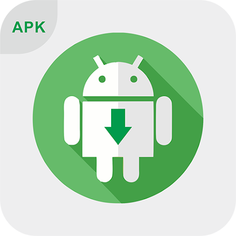
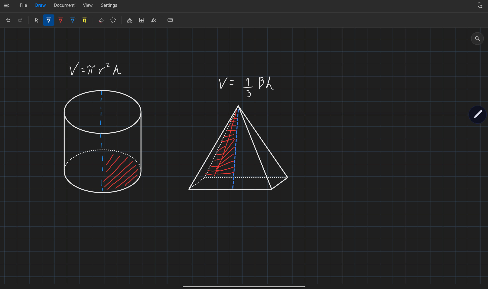
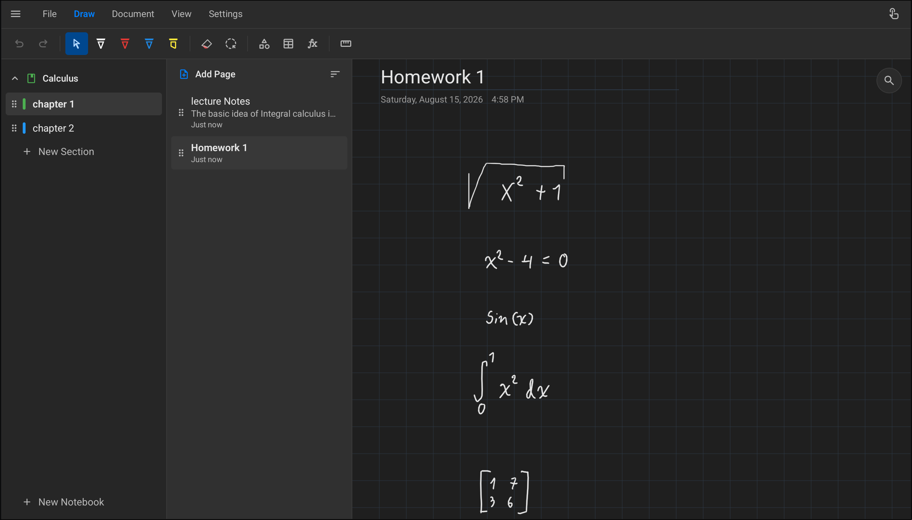
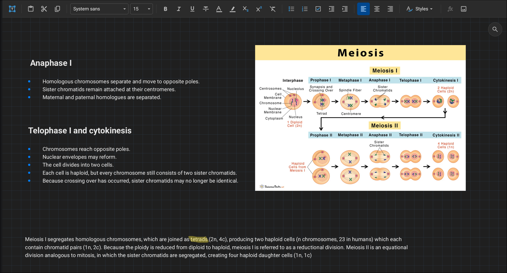
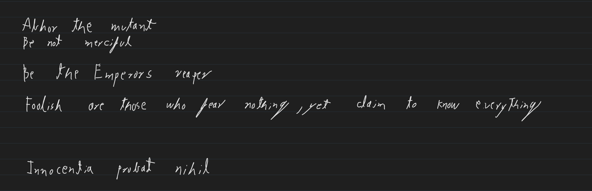
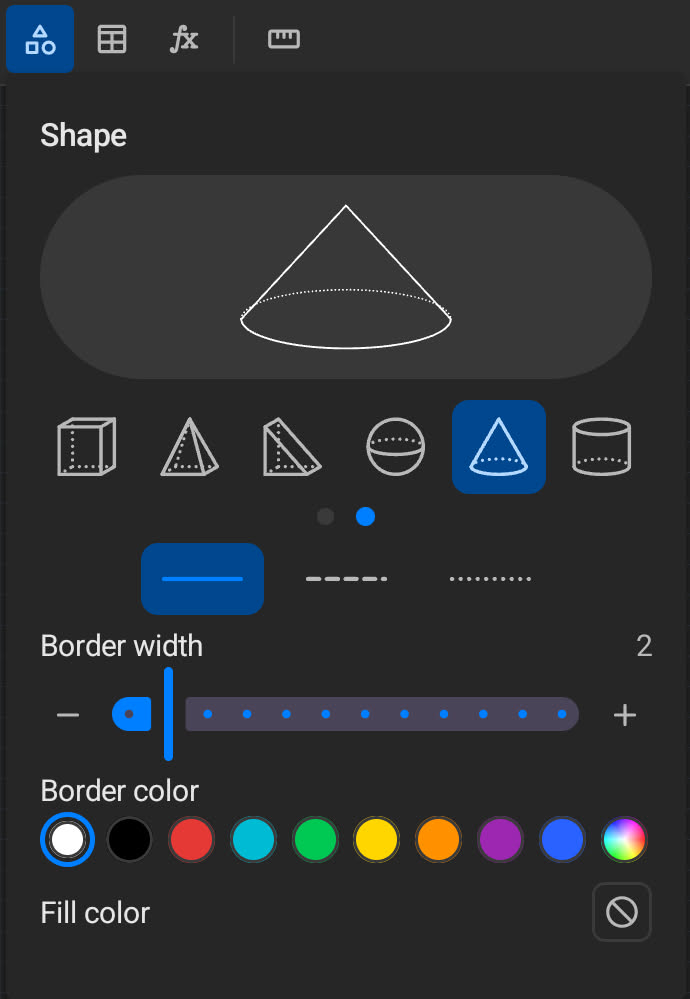
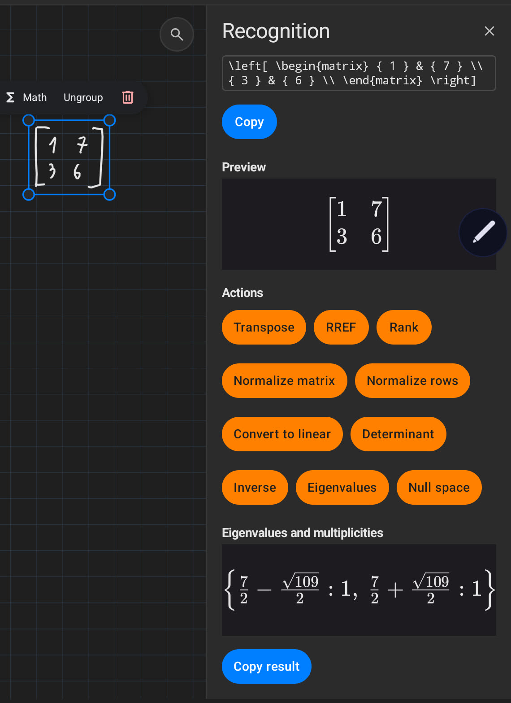
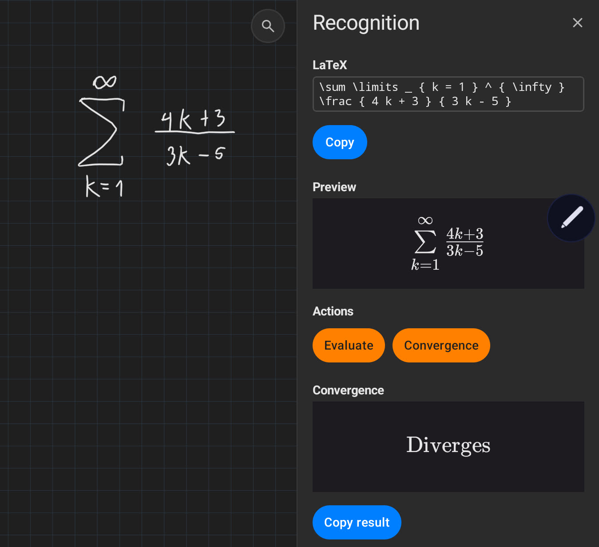

<a href='#acidburnmonkey'> 

# Vive Notes

A handwritten note-taking app built for students, combining the natural feel of pen and paper with the power
of digital documents.

All features are completely free, including cross-device sync. Your notes stay private: no data leaves your device,
and all AI features run entirely on-device.

# Download

<table>
  <thead>
    <tr>
      <th>F-Droid</th>
      <th>Google Play</th>
      <th>APK</th>
    </tr>
  </thead>
  <tbody>
    <tr>
      <td align="center">
        <a href="#">
          
        </a>
      </td>
      <td align="center">
        <a href="#">
          
        </a>
      </td>
      <td align="center">
        <a href="#">
          
        </a>
      </td>
    </tr>
    <tr>
      <td align="center"><b>Coming Soon!</b></td>
      <td align="center"><b>Coming Soon!</b></td>
      <td align="center">Available</td>
    </tr>
  </tbody>
</table>

# Features

- Local storage and AI processing on device.
- Fuzzy notebook search across text, tables, handwriting, and text found inside images.
- On-device handwriting and formula recognition, including math solving, evaluation, and graphing tools [docs](docs/calculator.md).
- Highly performant Ink rendering (7ms on over 10k strokes).
- Free-form page infinite canvas.
- Rich-text editing.
- Inline and free-form LaTeX equations with native rendering.
- Handwriting with configurable pens, pressure, smoothing.
- On-device image OCR.
- Custom paper: ruled, multiple grid sizes, dotted, hexagonal.
- Automatic database snapshots, and revision restoration.
- Open source export file format .vive , [docs](docs/viveFormat.md).
- Hardware keyboard shortcuts and configurable stylus buttons mappings.

# Gallery

| <a href='#acidburnmonkey'>  </a> |
| ------------------------------------------------------------------------ |
| <a href='#acidburnmonkey'>  </a>  |
| <a href='#acidburnmonkey'>  </a>  |

| <a href='#acidburnmonkey'>  </a> | <a href='#acidburnmonkey'>  </a> |
| ---------------------------------------------------------------------- | ----------------------------------------------------------------------- |
| <a href='#acidburnmonkey'>  </a> | <a href='#acidburnmonkey'>        |

# Self Host server

[Sync Server](https://github.com/AquilaIgnis/viveCServer)

# Road Map

- [ ] Fdroid release
- [ ] Play Store
- [ ] Linux & windows port
- [ ] Apple
- [ ] Web Client

# Donate To Project

<a href="https://www.buymeacoffee.com/acidburn" target="_blank"></a>

# Dev

## Run all tests

report: app/build/reports/androidTests/connected/

```bash

  ./gradlew connectedDebugAndroidTest
  ./gradlew connectedDebugAndroidTest \
    -Pandroid.testInstrumentationRunnerArguments.class=com.vivenotes.ui.editor.PageViewTest

```

# Acknowledgments

- [SymPy](https://www.sympy.org/en/index.html) , powers the math engine
- [Chaquopy](https://chaquo.com/chaquopy/), also the math engine
- [PaddlePaddle](https://github.com/PADDLEPADDLE/PADDLEOCR) , using their local models
- Claude & Codex
